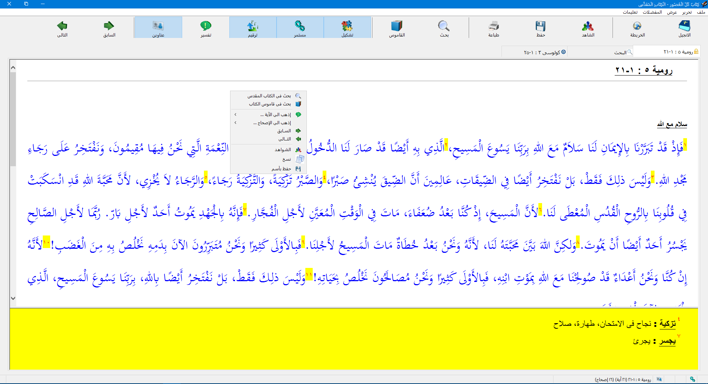

# Arabic Bible for Windows Users

### This application list the Arabic Holy Bible, it has :-

-  Old testament.
- New testament.
- Deuterocanon Bible | Second Canonical Books.
- Arabic Bible dictionary: Dictionary of the Bible, authored by a group of specialized professors and theologians, editorial board: Dr. Boutros Abdel-Malik - Dr. John Alexander Tamman - Professor Ibrahim Matar, tenth edition, issued by the House of Culture, Deposit No. of the Book House: 11718/1995, ISBN: 977-213-301-E.
- Also "كتاب ألتفسير التطبيقي للكتاب المقدس" book.

### Using Application

- No need for setup, just un-zip the file, run Bible.exe file.
- 100% Arabic interface.
- Show many places of bible, on many tabs.
- Many view option.
- Good and fast search on both bible books and Bible dictionary.
- Application made on 2011, Android version is available.

## Download link - Windows App

https://drive.google.com/file/d/1odXVTiY-2T0_4OhJG7KfOD6Eq3SyH6tk/view?usp=sharing

## Download link - Android App

https://play.google.com/store/apps/details?id=aym.soft.bible

